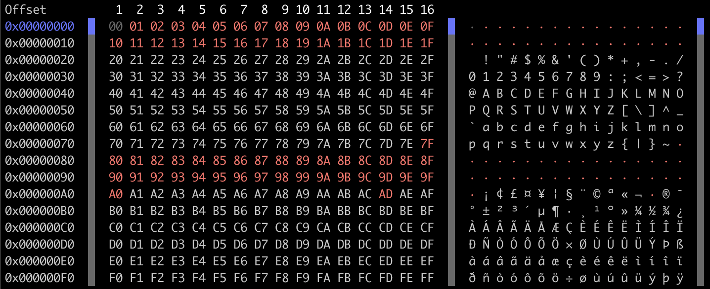

# hexss | Hex Stream Scan


Terminal application for scannning / reading e.g. file as hex output.

At the moment the input should be less than 4GiB.

## Features
```
usage: __main__.py [-h] [-n LINES] [-l {4,8,16,32,64,128}] [-c | -d] [-D] [-O]
                   [-T | -H] [-f] [-p]
                   file

Hex Stream Scan

positional arguments:
  file                  Path to the file to be scanned.

optional arguments:
  -h, --help            show this help message and exit
  -n LINES, --lines LINES
                        The number of lines.
  -l {4,8,16,32,64,128}, --len {4,8,16,32,64,128}
                        Number of bytes to print per line.
  -c, --compact         Print compact unicode representation.
  -d                    Disable bytes representation in Unicode.
  -D                    Hide header.
  -O                    Do not print the offset.
  -T, --tail
  -H, --head
  -f, --fill-empty      Fill the empty offset with zeros.
  -p                    Do not color the output.
```

## Installation with `user` privileges

### Installation
```bash
python3 setup.py install --user
```
or
```bash
pip3 install . --user
```

### Usage
```bash
python3 -m hexss --help
```

### Uninstall
```bash
pip3 uninstall hexss
```

## Simple output example
```bash
python3 -m hexss hexss/files/bytes_representation
```



